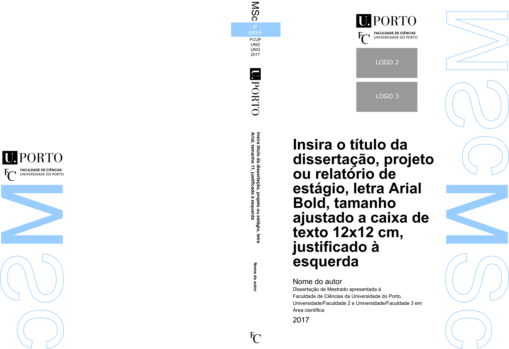

# FCUP thesis layout

Latex version of the thesis layout available at [http://sigarra.up.pt/fcup](https://sigarra.up.pt/fcup/pt/web_base.gera_pagina?p_pagina=*admiss%c3%a3o%20a%20provas%20acad%c3%a9micas).

All font rights belong to Microsoft.




## Requisites and Compiling

The recommended Latex distribution is [**TeXLive 2016**](https://www.tug.org/texlive) (Windows/Ubuntu). You can get it on the macOS by downloading **MacTeX** in [**here**](https://www.tug.org/mactex). The distribution [**MiKTeX**](https://miktex.org/) is likely to work, but you may have to manually install some packages depending on your settings.

For the Arial font and all packages to work, **_main.tex_** must be executed with `xelatex`. After making the proper modifications to the file **_vars.tex_**, you must run
```
xelatex -interaction=nonstopmode -file-line-error main
```

in the workspace root to generate the output PDF. Due to the use of external fonts, compilation may take more than a full minute.

Alternatively, a simpler way would be to use an online service like [**ShareLaTeX**](https://www.sharelatex.com) to obtain the layout pages. Download a copy of the repository under _Clone or download > Download ZIP_. Then, in ShareLaTeX website, import the downloaded .zip file in _New project > Upload project_, making sure that the compiler is set to _XeLaTeX_ under _Menu > Settings_.


## Contents

1. **_Title Page:_** Includes all relevant thesis information (with hyperlinks). To be included in the final thesis as the 1st page.
2. **_Examiner Page:_** Page with spaces for the examiner to sign and make the necessary comments. To be included in the final thesis as the 2nd page.
3. **_Disk Template:_** Printing template for disk.
4. **_Disk Cases:_** Front/back cover of the disk case.
5. **_Booklet Cover:_** Special page to be printed when assembling a booklet version of the thesis. Spine width is adjustable.


## File organization

The project itself is simplified such that there are two .tex files:
- **_main.tex:_** contains all the definitions, structuring and layouts/metrics of the document
- **_vars.tex:_** contains all information about the thesis type, title, author, ...
- **_fonts:_** contains all the Arial fonts used to render text
- **_logos:_** relevant university logos, including Universidade do Porto (UP), Universidade do Aveiro (UA) and Universidade do Minho (UM)
- **_msc:_** mandatory vector graphics for `msc` thesis type
- **_phd:_** mandatory vector graphics for `phd` thesis type


## Customizable parameters in **_vars.tex_**

#### `\thesistype{arg1}`

- **arg1:**  `msc` | `phd`

Change the layout between PhD (Doctor of Philosophy) and MSc (Master of Science)

#### `\spinewidth{arg1}`

- **arg1:** _title of the thesis for the front page_ (default: 13mm, minimum: 8mm)

Allows to change the width of the spine of the booklet cover

#### `\fronttitle{arg1}` and `\spinetitle{arg1}`

- **arg1:**  _title of the thesis for the front page/booklet spine_

This allows to change the titles used in the document

#### `\titlespacing{arg1}`

- **arg1:**  _line spacing multiplier for the title on the front page_ (default: 1.0)

This allows to change the line spacing for the title on the front page and booklet by changing this multiplier. You may want to adjust this value to 1.15/1.20 after changing to your thesis title.

#### `\authorname[href]{arg1}`

- **href:** _hyperlink used on the author field_ (optional)
- **arg1:** _name of the author_

Changes the author name. For the **href** can be used a website of a mail, using `mailto:mail@univ.edu` as hyperlink.
The **href** argument is optional, i.e. can be used `\authorname{arg1}` as well.

#### `\otheraffiliation[href]{arg1}{arg2}{agr3}` and `\extraaffiliation[href]{arg1}{arg2}{agr3}`

- **href:** _hyperlink used on the University2/University3 field_ (optional)
- **arg1:** _relative path to the logo of the University2/University3_
- **arg2:** _initials of the University2/University3_
- **arg3:** _full name of the University2/University3_

Sets up the pages to incorporate full name/logo/initials for the University2/University3 field.
The **href** argument is optional, i.e. can be used `\otheraffiliation{arg1}{arg2}{agr3}` as well.

#### `\degreename{arg1}`

- **arg1:** _full name of the degree_

#### `\sciencefield{arg1}`

- **arg1:** _name of the scientific area of the thesis_

#### `\supervisor[href]{arg1}` and `\cosupervisor[href]{arg1}`

- **href:** _hyperlink used on the supervisor/co-supervisor field_ (optional)
- **arg1:** _name of the supervisor/co-supervisor_

Commenting the `\cosupervisor` field hides the field in the titlepage.

#### `\supervisorposition{arg1}` and `\cosupervisorposition{agr1}`

- **arg1:** _position of the supervisor/co-supervisor_

These fields can be commented out separately.

#### `\supervisoraffiliation[href]{arg1}` and `\cosupervisoraffiliation[href]{arg1}`

- **href:** _hyperlink used on the supervisor/co-supervisor affiliation university_ (optional)
- **arg1:** _name of the supervisor/co-supervisor university_
